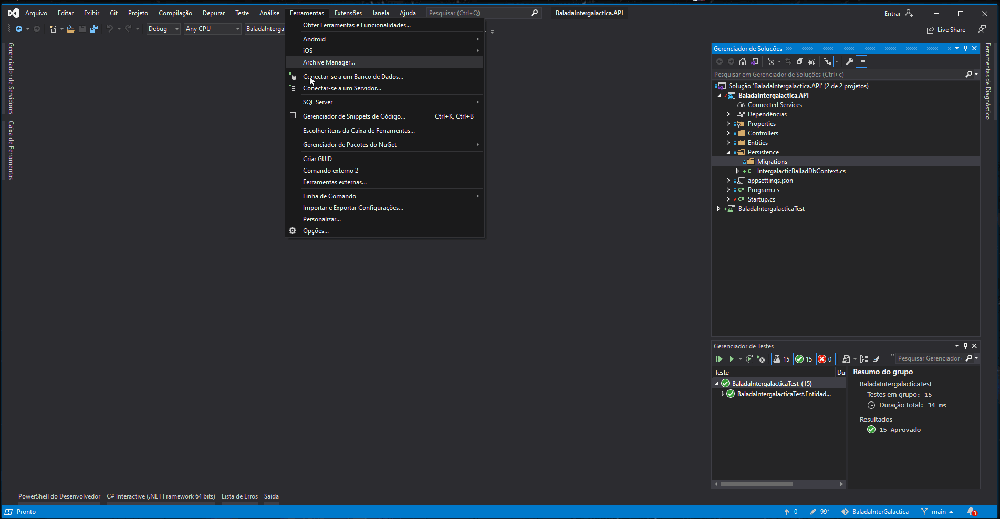
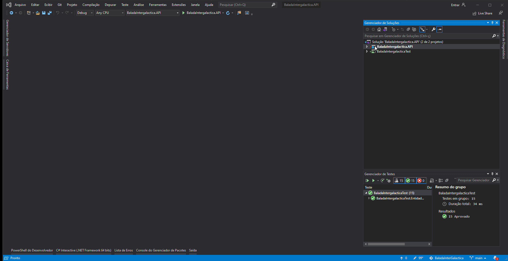

# BaladaIntergalactica
Projeto de uma aplicação que realiza algumas funções de cadastro. 

##  Sobre o Projeto

Está aplicação oferece uma API, Teste unitários e um Front end. Onde poderar estar cadastrando aliens, baladas, objetos proibidos, realizando check in e check out da balada.

### 🛠 Ferramentas Utilizadas

- [Visual Studio 16.8.4](https://visualstudio.microsoft.com/pt-br/)
- [AspNetcore 5.0.2](https://versionsof.net/core/5.0/5.0.2/)
- [Dapper 2.0.78](https://www.nuget.org/packages/Dapper/)
- [Microsoft.EntityFraneworkCore 5.0.2](https://www.nuget.org/packages/Microsoft.EntityFrameworkCore/5.0.2)
- [Microsoft.EntityFraneworkCore.SqlServer 5.0.2](https://www.nuget.org/packages/Microsoft.EntityFrameworkCore.SqlServer/)
- [Microsoft.EntityFraneworkCore.Tools 5.0.2](https://www.nuget.org/packages/Microsoft.EntityFrameworkCore.Tools)
- [Swashbucle.AspNetCore 5.6.3](https://www.nuget.org/packages/Swashbuckle.AspNetCore/)

- [Visual Studio Code 1.53.1](https://code.visualstudio.com/updates/v1_53)
- [Node.js 12.18.3](https://nodejs.org/en/blog/release/v12.18.3/) 
- [Yarn 1.22.10](https://classic.yarnpkg.com/en/docs/install/#windows-stable)

- [SQL Server 15.0](https://www.microsoft.com/pt-br/sql-server/sql-server-downloads)

### 🤔 Como Utilizar a Aplicação

- Faça o clone da pasta [BaladaIntergalactica](https://github.com/BrunoBastos97/BaladaIntergalactica.git) no github.
- Instale o SQL Server, caso você não tenha.
- Para Utilizar a aplicação, é preciso migra o banco, para isso siga as intrução no gif.

        

- Para Utilizar a aplicação, é preciso rodar a API, para isso siga as intrução no gif.

        

- Como Abrir o front end

        

### ❌ Restrições da API

- Não podera Realizar CheckIn se o Alien estiver em outra balada.
- Não podera Realizar CheckIn se o Alien com objetos proibidos.
- Não Realizar CheckIn se o Alien tiver idade inferior a 250 anos.
